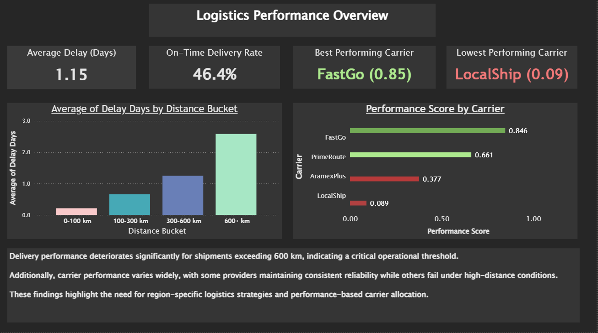
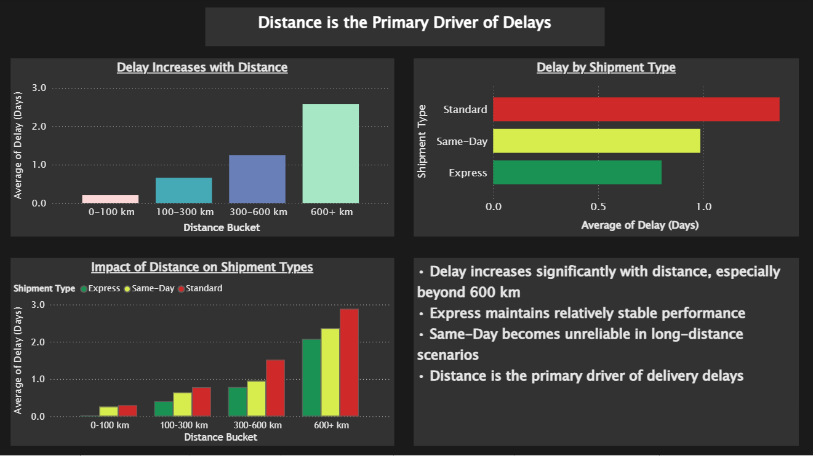
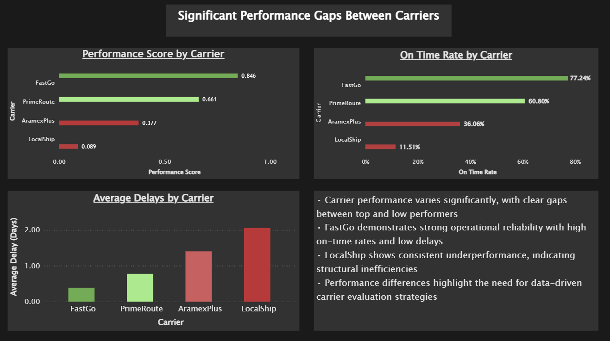
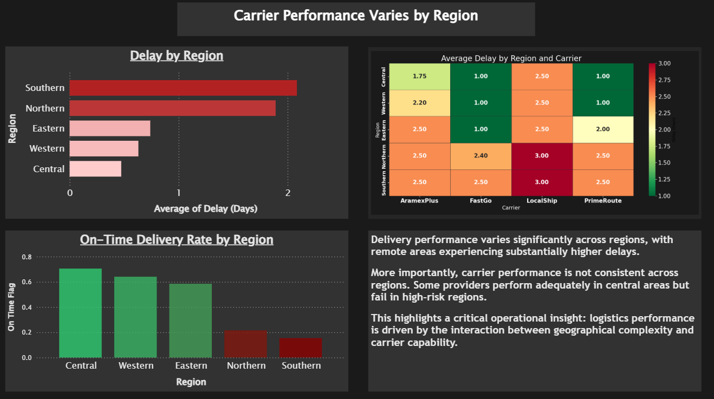
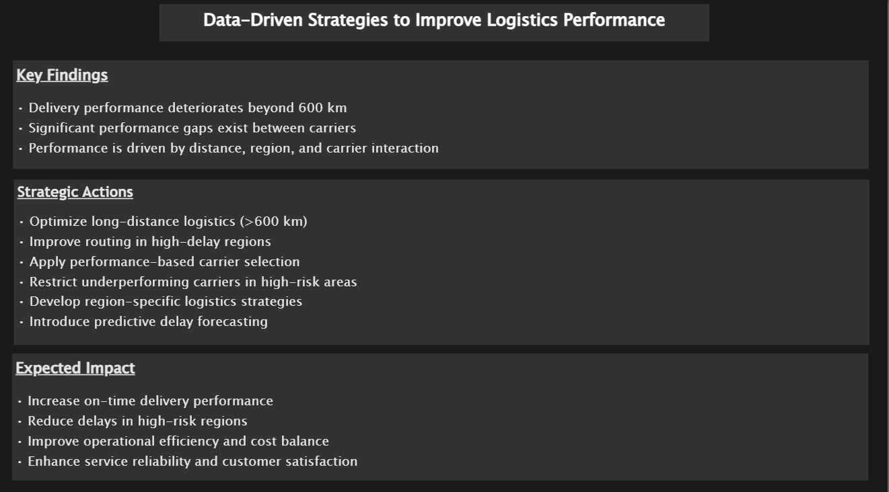

# Logistics Performance Analysis Dashboard 🚚📊

## 📌 Overview

This project provides a comprehensive analysis of logistics performance, focusing on identifying the key drivers of delivery delays and operational inefficiencies.

The analysis explores how delivery performance is impacted by:

* Distance
* Carrier performance
* Shipment type
* Regional differences

The goal is to move beyond basic reporting and deliver **data-driven insights that support operational decision-making**.

---

 **Note:** The dataset used in this project is synthetically generated based on realistic logistics patterns to simulate operational challenges and support analytical exploration.

## 🎯 Objectives

* Analyze delivery delays across multiple dimensions
* Evaluate carrier performance using a composite performance score
* Identify operational bottlenecks and inefficiencies
* Provide actionable, strategy-level recommendations

---

## 🛠 Tools & Technologies

* **Power BI** – Dashboard design & visualization
* **Python (Pandas)** – Data preparation & feature engineering
* **SQL (optional)** – Data structuring
* **Excel** – Initial data exploration

---

## Project Files
- `dashboard/logistics_dashboard.pbix` — Power BI dashboard
- `notebooks/data_generation.ipynb` — data preparation
- `notebooks/main_analysis` analysis
- `datasets/` — project data
- `images/` — dashboard screenshots

## 📊 Dashboard Structure

### 1. Executive Overview

Provides a high-level summary of:

* Average delay
* On-time delivery rate
* Best & worst performing carriers
* Key operational insights

---

### 2. Distance Impact Analysis

Focuses on how distance affects delivery performance:

* Delays increase significantly with distance
* Sharp performance deterioration beyond 600 km
* Distance identified as the primary operational driver

---

### 3. Carrier Performance Analysis

Evaluates logistics providers using:

* Performance score (weighted model)
* On-time delivery rate
* Average delay comparison

---

### 4. Regional Risk Analysis

Highlights geographic impact on logistics:

* Significant delay variations across regions
* High-risk regions with consistent underperformance
* Interaction between region complexity and carrier capability

---

### 5. Strategic Recommendations

Transforms insights into actionable strategies:

* Operational improvements
* Carrier performance optimization
* Region-specific logistics planning

---

## 🔍 Key Insights

* Delivery performance deteriorates significantly beyond 600 km
* Distance is the strongest driver of delays
* Carrier performance varies widely, indicating structural inefficiencies
* Regional factors play a critical role in delivery reliability
* Logistics performance is driven by the interaction of distance, region, and carrier

---

## 💡 Business Value

This analysis enables logistics stakeholders to:

* Identify operational bottlenecks
* Optimize routing and delivery planning
* Improve carrier evaluation using data-driven metrics
* Enhance overall delivery efficiency and reliability

---

## 📈 Performance Scoring Model

A composite performance score was developed using:

* On-time delivery rate (60%)
* Average delay (30%)
* Shipping cost efficiency (10%)

This model allows for a balanced evaluation of carriers based on both reliability and efficiency.

---

## 🔮 Future Improvements

* Build predictive models for delivery delays
* Integrate real-time logistics data
* Develop automated KPI monitoring dashboards
* Expand dataset to include additional regions and carriers

---

## Author
**Asem Haij**  
Data Analyst | Python • Power BI • SQL  
[LinkedIn](www.linkedin.com/in/asem-haij-9797562a8) | [GitHub](https://github.com/ProfASEM) | [Portfolio](https://asemhaij.com/)
---

## ⭐ Notes

This project is designed to reflect a **consulting-style analytical approach**, focusing on:

* Insight generation
* Business impact
* Strategic thinking

---
